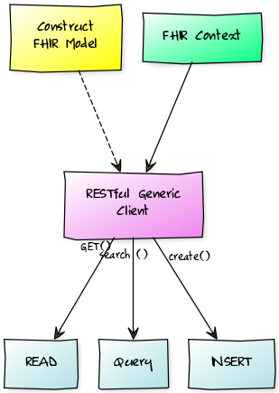

### FHIR Interactions
Evaluate interaction approaches against a `FHIR` server
Specifically, 
+ construct various model classes using `HAPI-FHIR` library
+ Construct generic RESTful client
+ Make requests to `Create/Get/Search` various resources

#### Flow

The architecture is as follows,


#### Query
`Search` function enables us to query a resource by any of its attributes.
To search by *zip code*, we can do,
```java
client.search().forResource(Organization.class).
                where(Organization.ADDRESS_POSTALCODE.matches().values("30309"))
                .returnBundle(Bundle.class).execute();
```